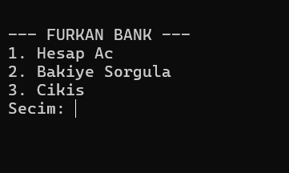

# C-Bank-Management-System
# 🏦 Bank Account System / C ile Banka Hesap Yönetimi

[Türkçe açıklamalar için aşağı kaydırın / Scroll down for Turkish]

---

## 🇺🇸 Project Overview
A procedural programming project developed in **C** that manages banking operations. It uses file handling to store customer data permanently and structural logic to manage account details.

### 📋 Key Technical Features
- **File-Based Persistence:** Stores account information (balance, name, ID) in `.dat` or `.txt` files using `fopen` and `fwrite`.
- **Structural Data:** Uses `struct` to group related data points, demonstrating C's ability to handle complex entities without OOP.
- **Transaction Logic:** Includes functions for deposit, withdrawal, and account balance inquiries with basic error checking.
- **Menu-Driven Interface:** A clean console-based UI for seamless user interaction.

---

## 🇹🇷 Proje Hakkında
Banka işlemlerini yöneten, **C** dilinde geliştirilmiş prosedürel bir programlama projesidir. Müşteri verilerini kalıcı olarak saklamak için dosya işleme (file handling) ve hesap detaylarını yönetmek için yapı (struct) mantığını kullanır.

### 📋 Teknik Özellikler
- **Dosya Bazlı Kalıcılık:** `fopen` ve `fwrite` kullanarak hesap bilgilerini (bakiye, isim, ID) harici dosyalarda saklar.
- **Yapısal Veri (Struct):** Nesne yönelimli programlama kullanmadan, karmaşık verileri gruplamak için `struct` yapısını sergiler.
- **İşlem Mantığı:** Para yatırma, çekme ve bakiye sorgulama gibi temel hata kontrollü fonksiyonlar içerir.
- **Menü Tasarımı:** Kullanıcı etkileşimi için temiz, konsol tabanlı bir arayüz sunar.

---
## 📸 Preview / Önizleme

*Programın çalışma anındaki menü ve işlem ekranı yukarıdaki gibidir.*

## 🚀 How to Run / Nasıl Çalıştırılır
1. **Compiler:** Bir C derleyicisine (GCC, Clang vb.) ihtiyacınız var.
2. **Compile:** Terminali açın ve şu komutu yazın: 
   `gcc banka.c -o banka`
3. **Run:** Derlenen dosyayı çalıştırın:
   `./banka` (Windows için `banka.exe`)
4. **Data:** Program çalıştığında aynı klasörde `banka.dat` adında bir dosya oluşacaktır, veriler burada saklanır.
